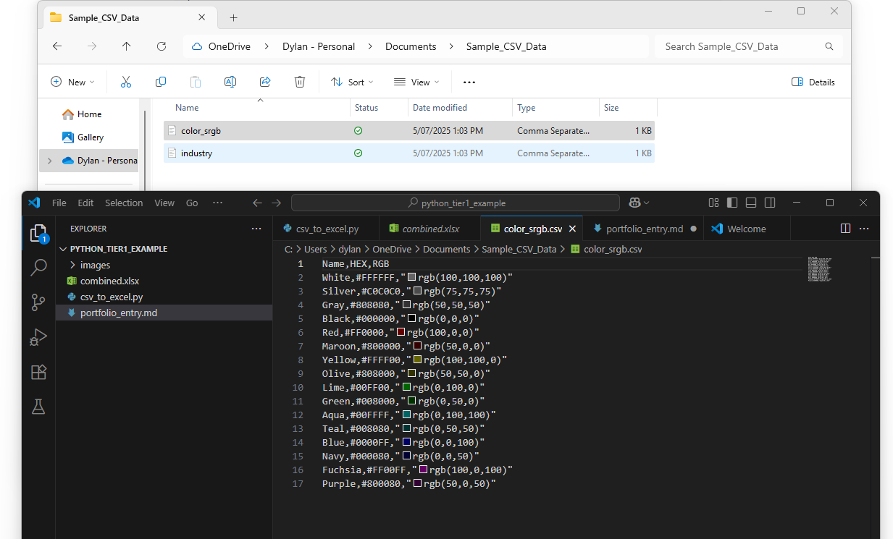
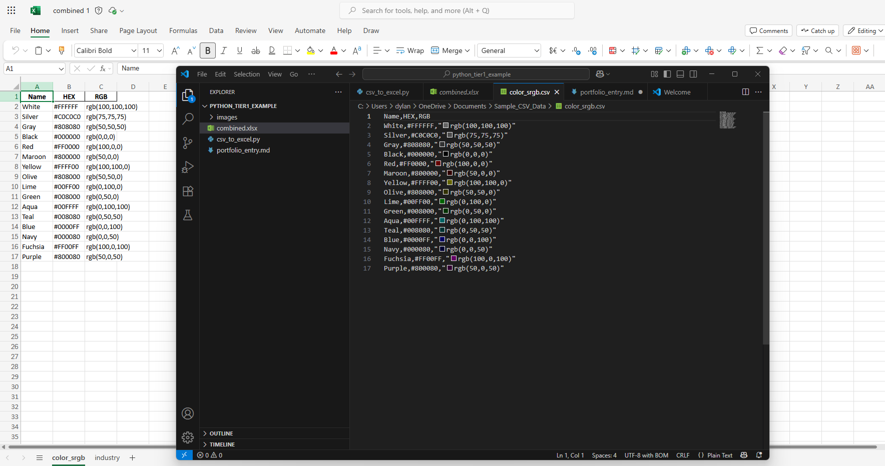

# 📂 CSV to Excel Multi-Sheet Converter

## 📝 **Problem Statement**
Small businesses often manage multiple CSV reports. Manually combining them into a single Excel workbook with separate sheets is time-consuming and error-prone.

---

## 🚀 **Solution**
This Python script:
- Reads all CSV files in a folder
- Exports them into one `.xlsx` file
- Adds each CSV as a separate sheet named after the file

---

## 💻 **Tech Used**
- Python 3.x
- pandas
- openpyxl

---

## 🔧 **How it Works**
1. Loop through CSV files in the folder
2. Read each into a pandas dataframe
3. Write each dataframe as a separate Excel sheet

---

## 📸 **Screenshots**

### 🔹 **Input folder**

### 🔹 **Script output**

---

## 📂 **GitHub Repository**
[View on GitHub](https://github.com/dylancleal/csv-to-excel-multisheet)

---

## 👨‍💻 **Author**
Dylan Cleal – Python Developer | Data Automation & Web Scraping Specialist

---
